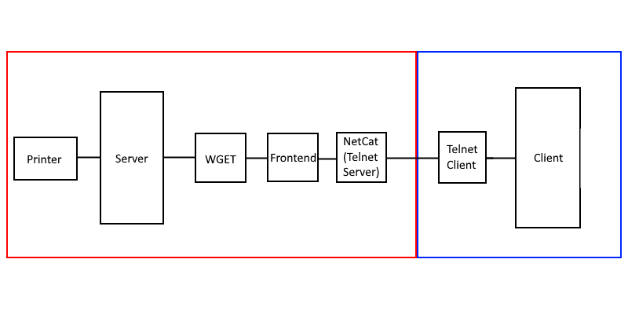

# OTN (Old To New) Remote Printing Standard
## "Letting Your Old Devices Print Again!"

Note, I was tired while making this, and kind of just winged it and threw some information on a file. It'll be revised some time later.

OTN Remote Printing Standard lets your older devices like a PowerMac G3 or a Windows 2000 computer communicate with newer printers. Or, to be more specific, make a newer computer communicate to a printer for it.

## OTN Standard Iterations
Note: These are not updates to the client or server software, but rather the overall concept of OTN.

### v1.00-release
OTN now uses NetCat raw TCP, and is therefor easier to make servers on any computer
Notice: It is not recommended to print from outside the local network with OTN as it does not have any encryption at all.

### v0.5.0-testing
OTN is now compatible with IBM compatibles!

### v0.1.1-testing
An update to OTN that doesn't do much but clean up v0.1.0 which was thrown together in an afternoon.

### v0.1.0-concept

The first version of OTN! No support for IBM compatibles yet, and basic functionality, but it works!

## How It Works
If you don't want to know and just want to set it up, skip this snd go to "Installation and Usage". Otherwise, read! It's pretty simple!

In this, the modern computer will be refered to as the "client" and the old computer the "server". This will be explained later.

The client hosts some scripts that controls all of the client-side magic. The server connects to the modern PC and inputs information (IP and file name).

### The Client-side Magic
The client consists of 3 components - the Frontend, WGET, and, the beating heart of OTN, PDFToPrinter. WGET downloads the PDF from the server and PDFToPrinter prints it, while the front end wraps it all up into a user-friendly script.

### The Not-As-Cool Server-side Magic
The server really only consists of an _ server, which hosts the PDF files on the computer.

## Why I Made This Project
Well it's a few years before college, I might as well start making some preparations. I decided I'd use my PowerMac G3 as my main computer and bring my desktop for gaming and to keep some servers I run operational. Sure, I could just use my desktop, but I just really want to use my PowerMac because I'm weird. So I will. One thing I know I'll have to do is print documents. However, I realized that its gonna be hard and expensive to find a printer that has drivers for Mac OS 9.2.2, so I needed a different solution, and that's when I made OTN.

## Installation and Usage
### PowerMac Instructions
Note: Be sure you have a way to get the computer on the internet (or LAN). There are many ways to do this because it has built in ethernet. For example, you can use <a href="https://pimylifeup.com/raspberry-pi-wifi-bridge/">this guide</a> to use your Raspberry Pi as a wifi to ethernet bridge.

1.) Download the ISO for the latest release of the server and burn it

2.) Download the client files to your modern desktop

3 (Optional).) Press "Win+R" and type in "shell:startup". Make a shortcut of the Frontend and copy the shortcut into the startup. This will make it run on startup.

4.) Start it (otn-client.exe). The client is now running and is ready for a connection!

5.) Insert the disk you just burned into the PowerMac.

6.) If you havn't done so already, install Stuffit Expander which is also on the ISO image you just burned.

7.) Install the RDP Client that is included in the server pack. You may also need to install the Java MRJ which is included just in case.

6.) Install the FTP Server by running the NetPresenz setup. Ensure you have file sharing on. Set the username and password to what you want. Change to home directory to the folder that contains your documents. It's reccomended to make the FTP server read-only for protection.

7.) Start the FTP Server. Both the server and the client are now set up!

### Windows 9x and 2000 Instructions
Note: Be sure you have a way to get the computer on the internet (or LAN). If your IBM compatible has ethernet, you can use <a href="https://pimylifeup.com/raspberry-pi-wifi-bridge/">this guide</a> to use your Raspberry Pi as a wifi to ethernet bridge.

1.) Download the ISO for the latest release of the server and burn it

2.) Download the client files to your modern desktop. Install TeamViewer 6 <a href="https://www.teamviewer.com/en/download/old-versions.aspx#version6">here.</a>. You'll see later why you can't use RDP.

3 (Optional).) Press "Win+R" and type in "shell:startup". Make a shortcut of the Frontend and copy the shortcut into the startup. This will make it run on startup.

4.) Start it (otn-client.exe). The client is now running and is ready for a connection!

5.) Insert the disk you just burned into the IBM compatible.

6.) Install TeamViewer. RDP doesn't work in Windows 9x because it doesn't have all libraries needed for it.

7.) Install FileZilla server. Be sure to create a user and allow read access to the directory of your choosing. You might have to disable directory viewing too, becauss LIST doesn't seem to work anymore.

8.) Connect to the modern computer with TeamViewer. You are now able to access the client, and you can start printing now!

### Usage
To print a document, convert it to PDF. Most office applications can do this. Then, connect to the modern computer via the RDP client or TeamViewer. Input the required information, and the modern computer will automatically print the file on its primary printer, or printer of your choosing.

Note: If you want to be able to print from anywhere in the world, you need to open the port the client's RDP server and the server's FTP server.

! UNDER CONSTRUCTION !

Instructions may be inaccurate and are not finished

&copy; Innovation Inc. 2019, &copy; SparrDrem 2019
